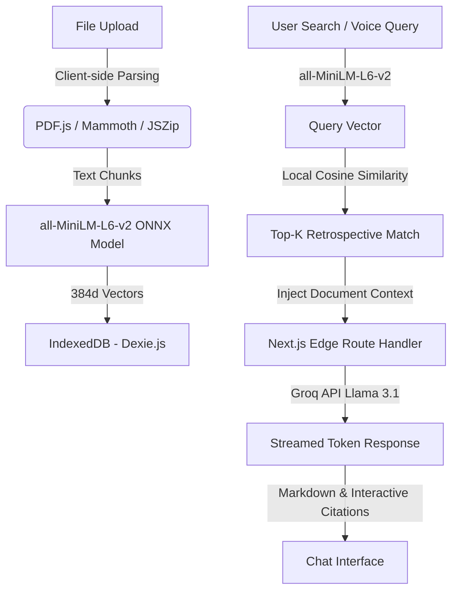

# DocMind — Local-First Document Intelligence

DocMind is a production-ready, client-side heavy RAG (Retrieval-Augmented Generation) document assistant. Users can upload PDFs, PPTXs, or DOCXs and query them in natural language using typed text or voice.

What makes DocMind unique is its **local-first, privacy-forward design**. All document text parsing, vector embeddings generation, and similarity search queries run fully inside your browser. No files, text chunks, or vector data are sent to cloud storage, preserving user privacy.

---

## 🚀 Key Features

*   **100% Browser Parsing**: Direct extraction of text from PDF, DOCX, and PPTX (slides + speaker notes) client-side.
*   **Local Embeddings**: Runs the ONNX-optimized `all-MiniLM-L6-v2` transformer model fully in-browser using `@xenova/transformers`.
*   **In-Browser Vector Search**: IndexedDB storage (via Dexie.js) caching vector indices. Cosine similarity queries run locally.
*   **Groq Llama 3.1 Inference**: Secure Next.js Edge route handlers stream inference results token-by-token from Groq's Llama 3.1 model.
*   **Clickable Source Citations**: Inline citations like `[Page X]` or `[Slide X]` are rendered as interactive buttons, loading a custom source excerpt panel.
*   **Dual STT Modes**: Real-time transcriptions using the Web Speech API (low latency) or Groq Whisper (high-accuracy audio upload fallback).
*   **Speech Synthesis (TTS)**: Web Speech Synthesis reads answers aloud with adjustable speech rate/pitch and custom animated voice orb visualizations.

---

## 🛠️ Architecture & Flow



1.  **Parsing**: Documents are parsed in-browser (PDF via PDF.js, DOCX via Mammoth, PPTX via custom JSZip XML reading).
2.  **Embedding**: Text chunks (~500–800 tokens with ~100 token overlap) are run through the local transformer model to output 384-dimensional vector arrays.
3.  **Storage**: Metadata and chunk vectors are written to IndexedDB.
4.  **Retrieval**: When a query is made, it is embedded locally. A scan is performed over the IndexedDB chunks, computing cosine similarity in JavaScript.
5.  **Inference**: The query and top-5 source chunks are sent to a Next.js route handler. Groq returns a token stream.
6.  **Interactive Citations**: References like `[Page 2]` are linked to IndexedDB chunk indexes. Clicking a reference highlights the source text.

---

## 🏗️ Setup & Running Locally

### 1. Prerequisites
*   Node.js (v18.0 or later)
*   NPM (v9.0 or later)
*   A Groq API Key (Sign up at the [Groq Console](https://console.groq.com/))

### 2. Install Dependencies
Navigate to the directory and run:
```bash
npm install
```

### 3. Environment Variable Configuration
Create a `.env.local` file at the root of the project:
```bash
cp .env.example .env.local
```
Open `.env.local` and add your Groq API Key:
```env
GROQ_API_KEY=gsk_your_groq_api_key_here
```

### 4. Run Development Server
```bash
npm run dev
```
Open [http://localhost:3000](http://localhost:3000) in your browser.

---

## 💾 Local Storage Tradeoffs & Future Upgrades

### Tradeoffs of Browser-Side RAG
1.  **Model Boot Time**: The first time a user generates an embedding, the browser downloads the `all-MiniLM-L6-v2` ONNX model (~90MB) from the Hugging Face CDN. Once downloaded, it is permanently cached in the browser's Cache Storage, leading to instant subsequent loads.
2.  **Memory Constraints**: Processing massive document libraries (>10,000 pages) can exceed browser memory and slow down Javascript vector calculations. For normal document sizes (a few hundred to a thousand chunks), the JS cosine-similarity search takes under 5ms.
3.  **Browser Storage Quotas**: Browser IndexedDB is subject to storage quotas (typically up to 50% of available disk space on desktop).

### Future Upgrades
For a production deployment supporting team workspaces, shared query indices, and millions of chunks:
*   **Vector DB Migration**: Swap out browser-side IndexedDB for a self-hosted server-side vector database like **sqlite-vec** (a SQLite extension for vector search) or **LanceDB** (an embedded, serverless, ultra-fast vector DB).
*   **Web Workers**: Outsource the `@xenova/transformers` feature extraction pipeline into a dedicated Web Worker to fully avoid blocking the browser UI thread during massive bulk uploads.
